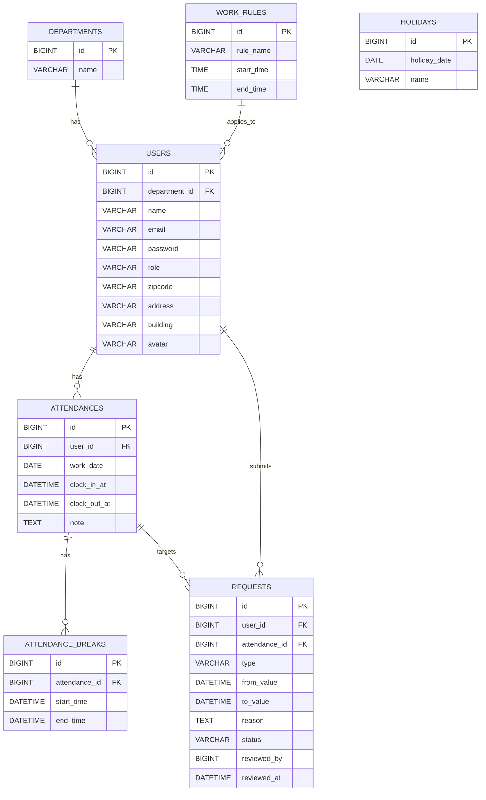

# kintai
## 概要
勤怠管理アプリ（出勤/退勤・休憩・申請/承認）をLaravel + Dockerで実装しました。

## 主な機能
- 出勤 / 退勤打刻
- 休憩開始 / 終了（複数回対応）
- 勤怠一覧表示（休憩時間・合計時間の計算）
- 申請 / 承認フロー（管理者）

## 起動方法（Docker）
（既存の手順があるならそのまま使う）

## テスト
php artisan test

## 環境構築
## Dockerビルド
    クローン
        git clone git@github.com:kiki1226/Coachtech-kintai.git
    起動 
        docker-compose up -d
    PHP コンテナに入る
        docker-compose exec php bash
    停止
        docker-compose down

## Laravel環境構築
    依存関係インストール
        composer install
    APP_KEY 生成
        php artisan key:generate
    ストレージ公開
        php artisan storage:link
    .env 用意
        cp .env.example .env
    マイグレーション
        php artisan migrate
    シーディング
        php artisan migrate --seed

## テストコード
    Feature / Unit テスト（PHPUnit）
        php artisan test
    Feature 一部指定
        php artisan test --filter=*****

## 管理者ログイン
    'name'      =>  管理者
    'email'     =>  admin@example.com
    'password'  =>  password
    
## URL（開発環境）
    勤怠登録画面                 =>  http://localhost/register
    トップページ(一般ログイン)  =>  http://localhost/login
    トップページ(管理ログイン)  =>  http://localhost/admin/login
    phpMyAdmin              =>  http://localhost:8080/
    メール確認 (mailhog)      =>  http://localhost:8025/

## 使用技術
    php     : 8.2-fpm
    Laravel : 11.45.2
    mysql   : 8.0.26
    nginx   : 1.21.1
    jQuery  :'3.8'

# ER図

